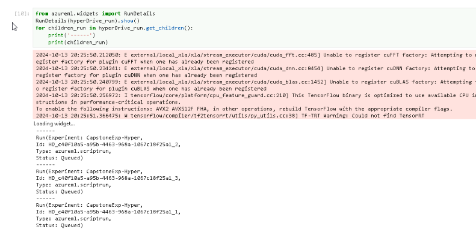

# Machine Learning Engineer with Microsoft Azure - Capstone Project

This project is the final capstone project of the Udacity Azure ML Nanodegree. In this project, two models are created: one using Automated ML and one customized model whose hyperparameters are tuned using HyperDrive. The performance of the two models is then compared and the best performing model deployed. Finally the endpoint produced will be used to get some answers about predictions.

## Project special Installation
In this repo I created the following files, which required to run the experiments:

- **automl.ipynb** : It is the notebook file for the AutoML (endpoint python script I written in here used to consume the produced endpoint)
- **train.py** : A python script that the HyperDrive operates on in order to produce the runs and find the best model.
- **hyperparameter_tuning.ipynb** : This is the notebook file I used for the HyperDrive.
- **Divorce-Predictor-Dataset.csv** : This is the dataset I used from here. The following came out from the running of the experiments
- **conda_dependencies.yml** : This is the environment file I downloaded from the Azure ML Studio.
- **hyper-model.pkl** : This is the best model from the HyperDrive I downloaded from Azure ML studio.
- **model.pkl** : This is the best model from the AutoML I downloaded from Azure ML studio.
- **hyper_scoring.py** : This is the scrore result from the HyperDrive training
- **automl_scoring.py** : This is the scrore result from the AutoML training

## Dataset

### Overview
The dataset I used is [Divorce-Predictor-Dataset.csv](https://www.kaggle.com/datasets/rabieelkharoua/split-or-stay-divorce-predictor-dataset/data) from Kaggle. it's The Divorce Predictors Scale (DPS) dataset which is derived from a study focused on predicting divorce using the DPS within the framework of Gottman couples therapy. The dataset comprises responses collected from participants, consisting of both divorced and married couples.

### The dataset features the following attributes ### 

- Participant ID: Unique identifier for each participant.
- Marital Status: Indicates whether the participant is divorced or married.
- Demographic Information: Includes age, gender, education level, and other relevant demographic factors.
- Responses to DPS Items: Each item of the DPS is represented as a separate attribute, providing insight into the participants' perceptions and behaviors related to marital dynamics.

-There are 54 questions, labeled Atr1 to Atr54, corresponding to Question 1 to Question 54.

-The last column is the status column, which indicates whether the individual is 'Married' or 'Divorced'. It is represented by a Boolean variable, where 'Married' is represented as '1' and 'Divorced' as '0'." The column "class"" is the target variable with value as 0 or 1.

### Data Statistics ###

### Task

The dataset released by the researchers includes ONLY the questions, responses, and the marital status (married or divorced).

[Survey questions](https://www.kaggle.com/datasets/rabieelkharoua/split-or-stay-divorce-predictor-dataset/data) can see in here from kanggle 

### Access

- The Azure Auto ML notebook reads the data using **Dataset.Tabular.from_delimeted_files()** and registers is as an Azure tabular dataset in the workspace.

- For the hyperparameter tuning, the data is loaded into the workspace using **TabularDataFactory** in the **hyper_train.py** script.

## Automated ML
## Automated ML configuration ##
Overview of the AutoML settings and configuration used for this experiment:
 
| Auto ML Configuration      | Value                | Explanation                                                                                                             |
| -------------------------- | -------------------- | ----------------------------------------------------------------------------------------------------------------------- |
| experiment_timeout_minutes | 20                   | Maximum duration in minutes that all iterations can take before the experiment is terminated                            |
| max_concurrent_iterations  | 4                    | Represents the maximum number of iterations that would be executed in parallel                                          |
| primary_metric             | accuracy             | This is the metric that the AutoML runs will optimize for when selecting the best performing model                      |
| compute_target             | compute_target(created) | The compute target on which we will run the experiment                                                                  |
| task                       | classification       | This is the nature of our machine learning task                                                                         |
| training_data              | dataset(imported)    | The training data to be used within the experiment                                                                      |
| label_column_name          | Class                | The name of the label column                                                                                            |
| path                       | ./project-folder     | This is the path to the project folder                                                                                  |
| enable_early_stopping      | TRUE                 | Enable early termination if the score is not improving                                                                  |
| featurization              | auto                 | Indicates if featurization step should be done automatically or not, or whether customized featurization should be used |
| debug_log                  | automl_errors.log    | The log file to write debug information to                                                                              |

The run details of the AutomatedML run are as below:
## The AutomatedML setting paramater and Config:

## Submit the AutoMLConfig to Experiment for training:

## The Best model

## The Best Model with name of Algorithm and the metrics

### Results

The AutoML experiment run generated **VotingEnsemble** algorithm as the best model with:

- **'accuracy': 0.9882352941176471**,
- **'f1_score_macro': 0.9881944444444445**,
- **'average_precision_score_micro': 0.9993370681605975**,
- **'f1_score_weighted': 0.9881944444444445**,
- **'balanced_accuracy': 0.9882352941176471**,
- **'recall_score_macro': 0.9882352941176471**,
- **'weighted_accuracy': 0.9882352941176471**,

**The Features importance - for Class: 0**

**The Features importance - for Class: 1**

**The Top Features by Their importance**

## The RunDetails widget to show the different experiments.

## Hyperparameter Tuning 

## Hyperparameter space

There are three types of sampling in the hyperparameter space:

### Random Sampling
Random sampling supports discrete and continuous hyperparameters. It supports early termination of low-performance runs. In random sampling, hyperparameter values are randomly selected from the defined search space.

### Grid Sampling
Grid sampling supports discrete hyperparameters. Use grid sampling if you can budget to exhaustively search over the search space. Supports early termination of low-performance runs. Performs a simple grid search over all possible values. Grid sampling can only be used with choice hyperparameters.

### Bayesian Sampling
Bayesian sampling is based on the Bayesian optimization algorithm. It picks samples based on how previous samples performed, so that new samples improve the primary metric. Bayesian sampling is recommended if you have enough budget to explore the hyperparameter space. For best results, recommend a maximum number of runs greater than or equal to 20 times the number of hyperparameters being tuned.

## Defining a Model Training

In this project,I used Logistric Regression algorithm from the SKLearn framework in conjuction with hyperDrive for hyperparameter tuning. There are three hyperparamters for this experiment: **C, max_iter and solver**.

## Defining the Hyperparamters tuning

I use Logistric Regression algorithm from the SKLearn framework in conjuction with hyperDrive for hyperparameter tuning. There are three hyperparamters for this experiment: **C, max_iter and solver**: 

- **C** (Inverse of regularization strength): is the inverse regularization strength (Default: 1.0). C controls the inverse of the regularization strength. A smaller value of C means stronger regularization (to prevent overfitting). In simpler terms:

        + Large C: Weak regularization (the model fits the training data closely).
        + Small C: Strong regularization (the model is more general, avoiding overfitting).

- **max_iter** (Maximum number of iterations): is the maximum iteration to converge for the SKLearn Logistic Regression (Default: 100). This defines the maximum number of iterations allowed for the algorithm to converge. In iterative algorithms like gradient-based optimization, this sets a limit to prevent infinite loops. If the model doesn't converge within max_iter iterations, it will stop, potentially with a warning that convergence wasn't achieved.

- **solver** (Algorithm to train the model): Default: 'lbfgs'. This specifies the optimization algorithm used for training. Different solvers can be used depending on the problem type, size, and whether it's a classification or regression task. Common solvers for models like logistic regression include:

        + **lbfgs**: Limited-memory Broyden–Fletcher–Goldfarb–Shanno algorithm, suited for smaller datasets and supports l2 regularization.
        + **sag and saga**: Stochastic solvers that are good for large datasets.
        + **liblinear**: A linear solver that's useful for small datasets and sparse data.

## Choose parameter sampling

Choosing a Sampling Strategy:
- **Grid Sampling**: Use when the parameter space is small and you want to evaluate all possible combinations.
- **Random Sampling**: Use when you have a large space and want to explore quickly.
- **Bayesian Sampling**: Use when you need efficiency and have a costly evaluation function.
- **Quasi-Random Sampling**: Use for uniform coverage when you have moderate computational resources.
- **Adaptive Sampling (Hyperband)**: Use when you need to dynamically allocate resources and prioritize promising configurations.

I have used **Random parameter sampling** to sample over a discrete set of values. Random parameter sampling is great for discovery and getting hyperparameter combinations that you would not have guessed intuitively, although it often requires more time to execute.

    # Specify parameter sampler
    sample_space = {
        'C': choice(0.01, 0.1, 1, 10, 100),
        'max_iter' : choice(50,75,100,125,150,175,200),
        'solver' : choice('liblinear','sag','lbfgs', 'saga')
    }
    # Specify the sampling pramater
    param_sampling = RandomParameterSampling(sample_space)

# Define an early termnination policy

After that, I will define an early termnination policy. The BanditPolicy basically states to check the job every 1 iterations. If the primary metric (defined later) falls outside of the top 20% range, Azure ML terminate the job. This saves us from continuing to explore hyperparameters that don't show promise of helping reach our target metric.

    early_termination_policy = BanditPolicy(evaluation_interval=1, slack_factor=0.2)

# Create hyperdrive config

I'm ready to configure a run configuration object, and specify the primary metric **Accuracy** that's recorded in your training runs. I also set the number of samples to 20, and maximal concurrent job to 4, which is the same as the number of nodes in our computer cluster.

    hyperdrive_run_config = HyperDriveConfig(
                                     hyperparameter_sampling=param_sampling,
                                     primary_metric_name='Accuracy',
                                     primary_metric_goal=PrimaryMetricGoal.MAXIMIZE,
                                     policy=early_termination_policy,
                                     run_config=src,
                                     max_concurrent_runs=4,
                                     max_total_runs=20,                                     
                                    )

## Hyperparameter Results
### Experiment Running

### Training model and Run Detail

### The Best model

# Compare Model Performance

| Model        | Accurancy |
| ------------ | --------- |
| Automated ML | 0.9882    |
| HyperDrive   | 0.9411    |

## Model Deployment with HyperDrive

### Retrieve the Best Model from HyperDrive

### Register the Best Model

### Define the Scoring Script and Environment

To deploy the model, create a scoring script and specify the environment the model will run in. The scoring script (hyhyper_score.py) will handle the inference logic for the model. Scoring Script (score.py):

### Deploy the Model as a Web Service

### Endpoint Sevices: Enable Loggin, Swagger URL and REST Endpoints

## Model Deployment with AutoML

### Retrieve the Best Model from HyperDrive

### Register the Best Model

### Define the Scoring Script and Environment

To deploy the model, create a scoring script and specify the environment the model will run in. The scoring script (hyhyper_score.py) will handle the inference logic for the model. Scoring Script (score.py):

### Deploy the Model as a Web Service

### Endpoint Services: Enable Loggin, Swagger URL and REST Endpoints

### A sample request sent to the endpoint and its response

# Screen Recording
- The screencast of the project demo with AutoML can be viewed (2:20): https://www.veed.io/view/462df68c-9dae-4c02-b176-97fa0d2dcec5
- The screencast of the project demo with HyperDriver can be viewed (2:55): https://www.veed.io/view/f38a6688-7f9b-48b2-a869-5dc76b086894?panel=share

## Standout Suggestions
*TODO (Optional):* This is where you can provide information about any standout suggestions that you have attempted.
- Using wider ranging hyperparameter sampling in the scikit-learn pipeline
- Enable Deep Learning in Classification while creating the AutoML experiment.
- Perform data preprocessing such as feature selection by observing the influence of features on different models.
